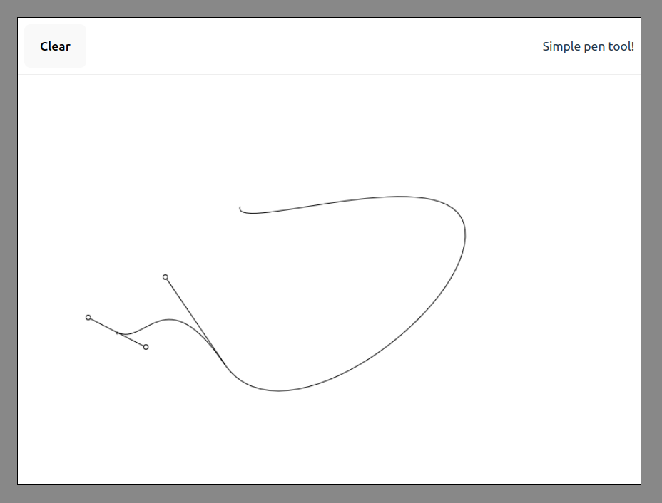

# Adobe Illustrator Pen Tool Clone

Very simple clone of the pen tool. It doesn't have all the features but demonstrates how pentool can be done in Canvas. This is a Work in progress!

# How to Use?

1. Clone this reponsitory in your machine `git clone https://github.com/prionkor/illustrator-pentool-clone.git`
2. Run `cd illustrator-pentool-clone`
3. Run `yarn & yarn dev`

Visit `http://localhost:5174` for the app.
